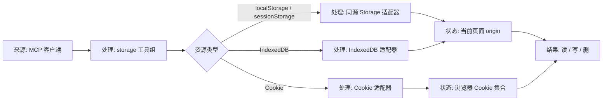
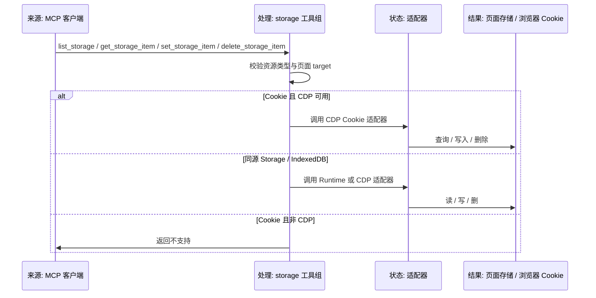

# 浏览器存储访问设计

## 背景

`vite-plugin-vue-mcp-next` 当前已经具备页面列表、DOM、Console、Network、Vue Runtime Bridge、Screenshot、Performance 和受控 `evaluate_script` 等能力，但还没有面向“浏览器存储”的专用工具组。

用户希望补齐同源存储和浏览器 Cookie 的调试能力，覆盖以下资源：

- 当前选中页面同源的 `localStorage`
- 当前选中页面同源的 `sessionStorage`
- 当前选中页面同源的 `IndexedDB`
- 浏览器级 `Cookie`

其中 `Cookie` 的边界已经确认：

- 只在 CDP 可用时开放查询和写入
- `HttpOnly` Cookie 允许查询
- `HttpOnly` Cookie 不允许删除

这类能力不能继续依赖通用 `evaluate_script` 兜底，因为 Cookie、Web Storage 和 IndexedDB 的调试语义不同，且 Cookie 在浏览器级查询和写入时需要明确区分 CDP 与 Runtime 环境。设计必须把“同源存储”“浏览器 Cookie”“CDP 可用性”“HttpOnly 限制”拆开表达，避免后续实现把高风险能力混在一起。Runtime 侧应使用专用存储桥接或页面内 helper，而不是继续复用通用脚本执行入口。

## 术语说明

| 术语 | 说明 |
| --- | --- |
| CDP | Chrome DevTools Protocol，浏览器调试协议。部分 Cookie 和 IndexedDB 能力只能通过它稳定访问 |
| Runtime | 页面内注入的运行时上下文。适合访问同源 Web API，但不具备浏览器级 Cookie 权限 |
| 同源 | 与当前选中页面的 `origin` 一致。这里不做跨域、跨站或全 profile 枚举 |
| HttpOnly Cookie | 只能被浏览器和协议层读写的 Cookie，页面脚本不能直接读取 |
| IndexedDB | 浏览器原生键值数据库，适合结构化业务数据和离线缓存 |
| object store | IndexedDB 中的对象仓库，等价于一层“表” |

## 目标

- 为当前选中页面提供专用存储工具组
- 同源 `localStorage` / `sessionStorage` 支持读、写、删
- 同源 `IndexedDB` 支持库级和 object store 级操作
- 浏览器级 `Cookie` 支持查询和写入
- `HttpOnly Cookie` 允许查询，不允许删除
- 通过统一的结构化响应返回资源、来源和限制说明
- 保持现有 `CDP 优先、Runtime 兜底` 的工程风格
- 明确区分“可用但受限”和“完全不支持”的情况

## 非目标

- 不做跨 origin 存储访问
- 不做全浏览器 profile 的存储枚举
- 不把 `CacheStorage`、Service Worker 缓存、File System Access 一起纳入首版
- 不提供条件查询引擎或复杂筛选语言
- 不把 Cookie 读写塞回 `evaluate_script`
- 不修改业务应用页面里的存储实现
- 不提供长期后台同步或自动监控

## 方案选择

### 方案 A：继续使用 `evaluate_script`

优点是实现快，不需要新增协议适配。缺点是边界混乱，Cookie、IndexedDB 和 Web Storage 会落在同一个通用执行入口里，后续排查和安全控制都不清晰。

### 方案 B：只做 Runtime 侧同源存储

优点是可以直接访问页面 Web API，适合 `localStorage`、`sessionStorage` 和部分 `IndexedDB` 操作。缺点是浏览器级 Cookie 仍然受限，`HttpOnly` 的读写边界也不够明确。

### 方案 C：专用 `storage` 工具组，CDP 优先，Runtime 兜底

推荐采用该方案。它把 Web Storage、IndexedDB 和 Cookie 的语义分层，并且能把 `Cookie` 的 CDP 专用约束明确表达出来：

- Runtime 负责同源 Web Storage 和同源 IndexedDB
- CDP 负责 Cookie 和更完整的 IndexedDB 读写删
- `HttpOnly Cookie` 只读不删

## 能力矩阵

| 资源 | Runtime | CDP | 备注 |
| --- | --- | --- | --- |
| `localStorage` | 支持 | 支持 | 仅同源 |
| `sessionStorage` | 支持 | 支持 | 仅同源 |
| `IndexedDB` 列库 / 列表 | 支持 | 支持 | 首版只做库级和 object store 级 |
| `IndexedDB` 读 / 写 / 删记录 | 支持 | 支持 | 仅同源，Runtime 侧通过页面上下文，CDP 侧优先稳定性 |
| `Cookie` 查询 | 不支持 | 支持 | 只在 CDP 环境开放 |
| `Cookie` 写入 | 不支持 | 支持 | 只在 CDP 环境开放 |
| `HttpOnly Cookie` 删除 | 不支持 | 不支持 | 保留查询，不开放删除 |

## 工具设计

### `list_storage`

列出当前选中页面同源可访问的存储资源，返回：

- `localStorage`
- `sessionStorage`
- `IndexedDB` 数据库列表
- Cookie 概览

Cookie 概览在 Runtime 环境下返回“不支持”说明，在 CDP 环境下返回浏览器级 Cookie 列表。

### `get_storage_item`

读取指定资源中的条目。

支持场景：

- `localStorage` / `sessionStorage` 按 key 读取
- Cookie 按 name 和匹配条件读取
- `IndexedDB` 按数据库、object store 和 key 读取

### `set_storage_item`

写入或更新指定资源中的条目。

支持场景：

- `localStorage` / `sessionStorage` 按 key 写入
- Cookie 按 name / value / domain / path 等参数写入，允许显式设置 `httpOnly`
- `IndexedDB` 按数据库、object store 和 key 写入

### `delete_storage_item`

删除指定资源中的条目。

支持场景：

- `localStorage` / `sessionStorage` 按 key 删除
- Cookie 按 name / domain / path 删除非 `HttpOnly` 条目
- `IndexedDB` 按 key 删除记录，或按 object store 删除整表数据

### `clear_storage`

清空当前页面同源的某一类存储资源。

支持场景：

- 清空 `localStorage`
- 清空 `sessionStorage`
- 清空某个 `IndexedDB` 数据库
- 清空当前可见 Cookie 范围，但跳过 `HttpOnly` 条目并返回跳过数量

## 架构设计

整体边界保持为三层：

- `src/mcp/tools/storage.ts` 负责 MCP 工具注册和输入校验
- `src/mcp/routeTools.ts` 负责页面目标解析、CDP 连接和通用错误响应
- `src/runtime/*` 或 `src/cdp/*` 负责具体存储适配

## 组件设计

### MCP 工具层

新增专用 `storage` 工具注册文件，避免把存储能力散落到 `evaluate` 或 `network` 中。

工具层只做三件事：

1. 校验资源类型和操作类型
2. 按页面目标解析当前 origin
3. 路由到 CDP 或 Runtime 适配器

### Runtime 适配器

Runtime 只处理当前页面同源的数据：

- `localStorage`
- `sessionStorage`
- `IndexedDB`

这里不承担 Cookie 逻辑，因为浏览器级 Cookie 需要明确的协议能力和更稳定的写入边界。

Runtime 侧不应直接暴露通用 `evaluate_script`，而应提供专用的存储桥接方法，把 `localStorage`、`sessionStorage` 和 `IndexedDB` 的访问收敛到固定接口里，减少误用面。

Runtime 适配器应该返回明确的限制说明：

- Cookie 不可用
- 只能访问当前页面同源资源
- 不能跨站枚举

### CDP 适配器

CDP 适配器负责浏览器级能力：

- `Storage.getCookies`
- `Storage.setCookies`
- `Network.deleteCookies`
- `DOMStorage.getDOMStorageItems`
- `DOMStorage.setDOMStorageItem`
- `DOMStorage.removeDOMStorageItem`
- `IndexedDB.requestDatabaseNames`
- `IndexedDB.requestDatabase`
- `IndexedDB.requestData`
- `IndexedDB.deleteDatabase`
- `IndexedDB.deleteObjectStoreEntries`

其中 Cookie 删除会显式屏蔽 `HttpOnly` 条目，避免把“可查询”误扩展成“可删除”。

## 变更流转

传播规则：

- `pageId` 决定目标页面
- `origin` 决定同源存储边界
- `Cookie` 只在 CDP 场景开放
- `HttpOnly Cookie` 查询和删除分离处理
- `IndexedDB` 先按库和 object store 定位，再展开到 key 级记录

## 错误处理

- 目标页面不存在时直接返回结构化错误
- 非同源访问直接拒绝，不做跨域兜底
- Runtime 环境下访问 Cookie 返回“不支持”
- 非 CDP 环境下 Cookie 写入返回“不支持”
- `HttpOnly Cookie` 删除请求返回明确拒绝，不做静默失败
- IndexedDB 库不存在或 object store 不存在时返回结构化错误
- 所有外部输入都按类型和字段校验，不接受裸对象透传

## 测试计划

### 单元测试

1. `storage` 工具注册和路由测试
2. 同源 `localStorage` / `sessionStorage` 读写删测试
3. Cookie 查询和写入在 CDP 场景下的测试
4. `HttpOnly Cookie` 查询可用、删除拒绝的测试
5. `IndexedDB` 库级和 object store 级查询、删除测试
6. 非 CDP 环境下 Cookie 返回不支持的测试

### 集成测试

1. 在带 CDP 的页面里验证 Cookie 查询和写入
2. 在无 CDP 的页面里验证 `localStorage` / `sessionStorage` 可用
3. 在同源页面里验证 `IndexedDB` 列库和按 key 读取

## 验收标准

- 能通过 MCP 工具读写删当前页面同源的 `localStorage` / `sessionStorage`
- 能通过 MCP 工具读取和写入浏览器 Cookie
- `HttpOnly Cookie` 可以被查询，但不会被删除
- 能通过 MCP 工具列出和操作当前页面同源的 `IndexedDB`
- 非 CDP 环境下 Cookie 能力明确返回不支持
- 现有 DOM、Network、Vue、Performance 能力不受影响
- 相关测试覆盖新增边界
