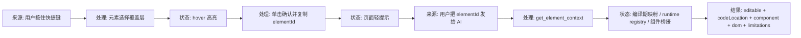
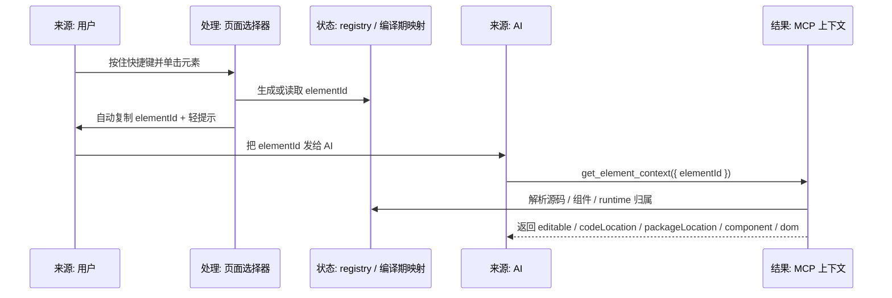

# 元素选择与上下文查询设计

## 背景

`vite-plugin-vue-mcp-next` 现有能力已经覆盖页面列表、DOM、Console、Network、Screenshot、Performance、Storage，以及 Vue Runtime Bridge 相关的组件树、组件状态、Router 和 Pinia 信息。

这次要补的是一条更适合 AI 开发协作的新链路：

1. 用户在页面里按住快捷键进入元素选择模式
2. hover 预览，单击确认目标元素
3. 页面自动复制一个可读的 `elementId`
4. 用户把这个 `elementId` 发给 AI
5. AI 调用 `get_element_context` 获取可直接用于修改的上下文

目标不是做“最近点击元素”的会话状态，也不是让 MCP 阻塞等待用户选择。首版要把“复制给 AI 的 ID”做稳，再把 AI 查询上下文的边界说清楚。

## 术语说明

| 术语 | 说明 |
| --- | --- |
| MCP | Model Context Protocol，本地工具调用协议 |
| Runtime | 注入到页面中的运行时上下文，适合做选择器、复制、短 ID registry 和兜底查询 |
| 编译期 ID | 构建阶段注入到项目源码里的可读标识，能稳定回到源码位置 |
| 运行时 ID | 页面加载后生成的短 ID，只在当前页面生命周期内有效 |
| 第三方组件 | 来自 `node_modules` 的组件或依赖入口，不属于当前项目源码 |
| `editable` | 告诉 AI 这个结果是否可以直接改源码 |
| `codeLocation` | 可修改的源码位置，包含 `file`、`line`、`column` |

## 目标

- 支持按住快捷键进入元素选择模式
- 支持 hover 高亮和 click 确认
- 点击后自动复制可读 `elementId`
- 页面显示轻提示，明确告知用户已经复制成功
- AI 可以通过 `get_element_context({ elementId })` 查询上下文
- 项目源码优先返回可修改的源码位置
- 第三方组件只返回 `npm 包名 + 入口文件`
- 运行时兜底节点使用短 ID，并在失效时返回明确原因

## 非目标

- 不做 MCP 阻塞等待用户点击
- 不做“最近点击元素”作为主入口
- 不把第三方组件伪装成项目源码级行列定位
- 不把所有 DOM 节点都写成可编辑源码位置
- 不在首版里做完整 IDE 跳转联动

## 方案确认

用户已确认采用混合方案：

- 项目源码节点：编译期注入可读 ID
- 第三方组件：只返回 `npm 包名 + 入口文件`
- 动态 DOM：运行时生成短 ID 兜底
- 单击后自动复制 ID，并显示轻提示
- MCP 按用户给出的 `elementId` 查询上下文

默认快捷键采用可配置策略，初始值参考 `Option + Shift` / `Alt + Shift`。

## 架构设计



职责边界分三层：

- 浏览器 runtime 只负责选择、复制、提示和 runtime registry
- Vite 编译期只给项目源码注入可读 ID 和源位置映射
- MCP 只负责按 `elementId` 解析上下文，不维护“最近选择”会话

## 数据流



## `elementId` 规则

### 项目源码

格式：

```text
src/pages/Home.vue:12:8
```

语义：

- 这是首选可修改位置
- AI 可以直接据此定位源码
- 返回时必须带 `editable: true`

### 第三方组件

格式：

```text
pkg:element-plus/Button
```

语义：

- 这是包级边界，不假装返回 node_modules 内部可编辑源码
- 返回时必须带 `editable: false`
- 只返回 `npm 包名 + 入口文件`

### 运行时兜底

格式：

```text
runtime:vmcp_abc123
```

语义：

- 只在当前页面生命周期内有效
- 由 runtime registry 维护
- 若页面刷新或节点卸载，必须返回明确失效原因

## 返回结构

`get_element_context` 的结果必须显式表达“能不能改”和“改哪里”。

建议字段如下：

```json
{
  "elementId": "src/pages/Home.vue:12:8",
  "editable": true,
  "codeLocation": {
    "file": "src/pages/Home.vue",
    "line": 12,
    "column": 8
  },
  "component": {
    "name": "HeroCard",
    "source": {
      "file": "src/pages/Home.vue",
      "line": 12,
      "column": 8
    }
  },
  "dom": {
    "tag": "button",
    "text": "保存",
    "attrs": {
      "data-v-mcp-id": "src/pages/Home.vue:12:8"
    }
  },
  "limitations": []
}
```

### 结果分层

- `editable: true` 时，AI 可以直接根据 `codeLocation` 修改源码
- `editable: false` 时，AI 只能拿上下文，不能假定可直接改源码
- `component` 优先返回，`dom` 作为辅助定位和视觉上下文

### 第三方组件返回

第三方组件结果必须返回：

- `editable: false`
- `packageLocation.packageName`
- `packageLocation.entryFile`
- `component.name`
- `dom` 摘要

不返回 node_modules 物理路径作为主结果。

示例：

```json
{
  "elementId": "pkg:element-plus/Button",
  "editable": false,
  "packageLocation": {
    "packageName": "element-plus",
    "entryFile": "Button"
  },
  "component": {
    "name": "ElButton"
  },
  "dom": {
    "tag": "button",
    "text": "保存"
  },
  "limitations": [
    "third-party component source is not treated as editable project code"
  ]
}
```

## 错误处理

### 剪贴板失败

如果浏览器权限或上下文限制导致复制失败，页面必须降级提示：

- `复制失败，请手动复制元素 ID`

### 运行时元素失效

如果 runtime 短 ID 已失效，MCP 必须返回明确原因：

- 元素被卸载
- 页面刷新
- registry 已清理

并建议用户重新选择元素。

### 无法映射到源码

如果元素只能定位到第三方组件或运行时节点，必须明确返回：

- `editable: false`
- 限制说明
- 尽可能提供可用的 package 或 runtime 边界信息

### 选择模式退出

如果用户松开快捷键或页面离开选择态，覆盖层必须恢复普通状态，不能长期污染页面交互。

## 组件设计

### 浏览器 runtime

职责：

- 安装选择覆盖层
- 支持快捷键进入/退出选择态
- hover 高亮元素
- click 后自动复制 `elementId`
- 显示轻提示
- 维护 runtime registry

### 编译期注入

职责：

- 只处理项目源码
- 注入可读 `data-v-mcp-id`
- 建立源码位置映射
- 为 Vue 组件语义提供可追溯来源

### MCP 工具层

职责：

- 新增 `get_element_context`
- 按 `elementId` 解析上下文，必要时结合 `pageId` 锁定当前页面
- 返回 `editable`、`codeLocation`、`packageLocation`、`component`、`dom` 和 `limitations`
- 保持输出适合 AI 直接消费

输入建议如下：

```ts
interface GetElementContextInput {
  elementId: string
  pageId?: string
}
```

规则：

- `pageId` 默认可选
- 当页面只有一个可操作目标时，可以省略 `pageId`
- 当同一 `elementId` 可能对应多个页面实例，或 runtime 短 ID 只属于某个页面时，必须传 `pageId`
- 解析失败时要返回明确错误，而不是猜测错误页面

## 测试与验收

### 单元测试

- `elementId` 分类和解析
- `editable` 判断
- 项目源码、第三方组件、runtime 三类返回结构
- 失效原因和限制说明
- 页面提示文案

### 编译测试

- 只对项目源码注入 ID
- 不污染第三方依赖
- 不影响生产构建

### runtime 测试

- 快捷键进入选择态
- hover 高亮
- click 自动复制
- 轻提示出现
- registry 失效后返回明确错误

### 真实联调

- 启动 playground
- 手动选择元素并复制 ID
- 用 `get_element_context` 查询结果
- 验证结果可直接用于 AI 修改源码

## 完成标准

- 项目源码元素可复制可读 ID，并返回 `editable: true + codeLocation`
- 第三方组件返回 `editable: false + packageName + entryFile`
- runtime 兜底 ID 在当前页可查，刷新后明确失效
- 单击后自动复制并提示 `元素位置已复制，请发送给 AI`
- `get_element_context` 返回结果能直接指导 AI 修改源码
